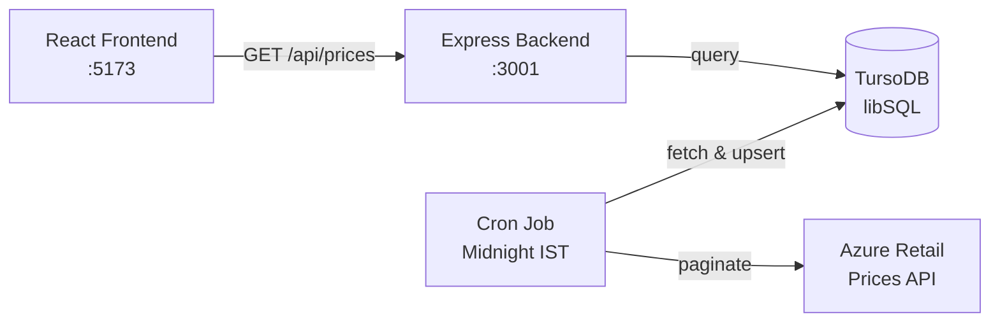

<div align="center">

# ⚡ CalcAI — Smart Pricing Assistant

**An intelligent Azure Pricing Calculator that fetches real-time pricing, compares savings plans, and helps you estimate cloud costs with AI.**

[](https://react.dev)
[](https://vite.dev)
[](https://expressjs.com)
[](https://turso.tech)

</div>

---

## 🎯 What Is CalcAI?

CalcAI is a full-stack Azure Pricing Calculator that goes beyond the basics. It fetches pricing data from the [Azure Retail Prices API](https://learn.microsoft.com/en-us/rest/api/cost-management/retail-prices/azure-retail-prices), caches it in TursoDB for fast lookups, and gives you a clean, modern interface to explore, compare, and estimate costs — with AI assistance.

### ✨ Key Features

| Feature | Description |
|---------|-------------|
| 🔍 **Service Browser** | Browse 100+ Azure services with real-time pricing |
| 💰 **Savings Plans & Reservations** | Compare Pay-as-you-go, 1yr/3yr Savings Plans, and Reserved Instances |
| 🖥️ **VM Configuration** | Full VM setup — OS licensing, Azure Hybrid Benefit, Managed Disks, Bandwidth |
| 🧮 **Cost Breakdown** | Line-by-line: Compute + OS + Disks + Bandwidth = Total (monthly & yearly) |
| 🤖 **AI Assistant** | Natural language queries — *"How much is a D4 v3 in East US?"* |
| 🌍 **Multi-Region & Currency** | 20+ Azure regions, 10 currencies (USD, INR, EUR, GBP, etc.) |
| 🌓 **Dark / Light Theme** | Toggle between themes, persisted in localStorage |
| 📦 **Export Estimates** | Download your estimate as a `.txt` report |
| ⚡ **Cached Backend** | TursoDB caches pricing data — syncs nightly, no Azure API rate limits |

---

## 🏗️ Architecture

```
CalcAI/
├── frontend/      React + Vite              → http://localhost:5173
├── backend/       Express + TursoDB API     → http://localhost:3001
└── README.md
```



---

## 🚀 Getting Started

### Prerequisites

- [Node.js](https://nodejs.org/) (v18+)
- [Turso CLI](https://docs.turso.tech/cli/installation) (free tier works fine)

### 1️⃣ Clone & Setup Turso

```bash
git clone https://github.com/your-username/calcai.git
cd calcai

# Create a free Turso database
turso db create azure-pricing
turso db show azure-pricing --url          # copy the URL
turso db tokens create azure-pricing       # copy the token
```

### 2️⃣ Configure Backend

```bash
cd backend
cp .env.example .env
```

Edit `backend/.env`:
```env
TURSO_DATABASE_URL=libsql://azure-pricing-your-username.turso.io
TURSO_AUTH_TOKEN=eyJhbGci...your-token
PORT=3001
SYNC_CRON=0 0 * * *
```

### 3️⃣ Start Backend & Load Data

```bash
cd backend
npm install
npm run dev
```

In another terminal, trigger the initial data sync:
```bash
# Quick sync (~30s, 5 popular services, eastus, USD)
curl -X POST http://localhost:3001/api/sync/quick

# Full sync (~10 min, 30+ services, 20 regions, 4 currencies)
curl -X POST http://localhost:3001/api/sync
```

### 4️⃣ Start Frontend

```bash
cd frontend
npm install
npm run dev
```

Open **http://localhost:5173** 🎉

---

## 🔌 API Endpoints

| Method | Endpoint | Description |
|--------|----------|-------------|
| `GET` | `/api/prices?serviceName=...&region=...&currency=...` | Query cached prices |
| `GET` | `/api/prices/search?q=virtual+machines` | Text search |
| `POST` | `/api/sync` | Trigger full sync (background) |
| `POST` | `/api/sync/quick` | Quick sync (5 services, 1 region) |
| `GET` | `/api/health` | Status, uptime, last sync info |

### Example

```bash
curl "http://localhost:3001/api/prices?serviceName=Virtual%20Machines&region=eastus&currency=USD&limit=5"
```

---

## 🤖 AI Assistant (Optional)

The AI chat assistant supports any OpenAI-compatible API. Configure in `frontend/.env`:

```env
VITE_AI_ENDPOINT=https://api.openai.com/v1/chat/completions
VITE_AI_API_KEY=sk-...
VITE_AI_MODEL=gpt-4o-mini
```

Works with: **OpenAI**, **Azure OpenAI**, **Groq**, **Ollama** (local), or any compatible endpoint.

If not configured, the assistant runs in a built-in keyword-matching mode.

---

## 🔄 Data Sync

| Mode | Scope | Duration | Trigger |
|------|-------|----------|---------|
| **Quick** | 5 services, eastus, USD | ~30s | `POST /api/sync/quick` |
| **Full** | 30+ services, 20 regions, 4 currencies | ~10 min | `POST /api/sync` |
| **Nightly** | Full sync | Automatic | Cron at midnight (configurable) |

Data is stored in TursoDB with `ON CONFLICT` upsert — no duplicates, always fresh.

---

## 🛠️ Tech Stack

| Layer | Tech |
|-------|------|
| Frontend | React 19, Vite 7, React Router, Lucide Icons |
| Backend | Express 4, Node.js |
| Database | TursoDB (libSQL) |
| Scheduling | node-cron |
| API Source | [Azure Retail Prices REST API](https://learn.microsoft.com/en-us/rest/api/cost-management/retail-prices/azure-retail-prices) |
| Styling | Custom CSS with CSS Variables (light/dark themes) |

---

## 📁 Environment Variables

### Backend (`backend/.env`)

| Variable | Required | Description |
|----------|----------|-------------|
| `TURSO_DATABASE_URL` | ✅ | Turso database URL |
| `TURSO_AUTH_TOKEN` | ✅ | Turso auth token |
| `PORT` | | Server port (default: 3001) |
| `SYNC_CRON` | | Cron schedule (default: `0 0 * * *`) |

### Frontend (`frontend/.env`)

| Variable | Required | Description |
|----------|----------|-------------|
| `VITE_API_URL` | ✅ | Backend URL (e.g., `http://localhost:3001/api`) |
| `VITE_AI_ENDPOINT` | | AI API endpoint |
| `VITE_AI_API_KEY` | | AI API key |
| `VITE_AI_MODEL` | | AI model name (default: `gpt-4o-mini`) |

---

## 📄 License

MIT

---

<div align="center">
  <sub>Built with ⚡ by leveraging the Azure Retail Prices API</sub>
</div>
